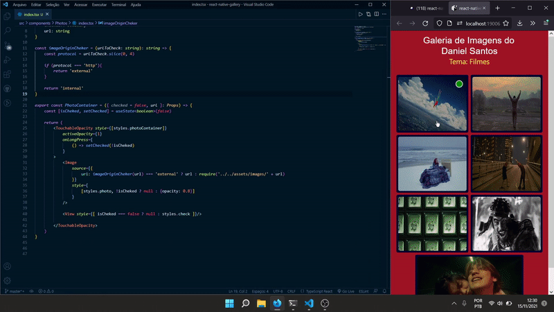

# Atividade 2 - Galeria com React Native

Aplicação feita para a segunda atividade da matéria de Tópicos Especiais

## Demonstração
\


## Instalando

Certifique-se de possuir o Typescript e o Expo instalados, para rodar o projeto basta clonar este repositório, rodar ``` npm install ``` ou ``` yarn install ``` dependendo do seu gerenciador de pacotes.

## Rodando

Para executar, basta utilizar o comando ``` expo start ``` para abrir o Metro Bundler no navegador, e daí escolher onde você deseja rodar o projeto.
